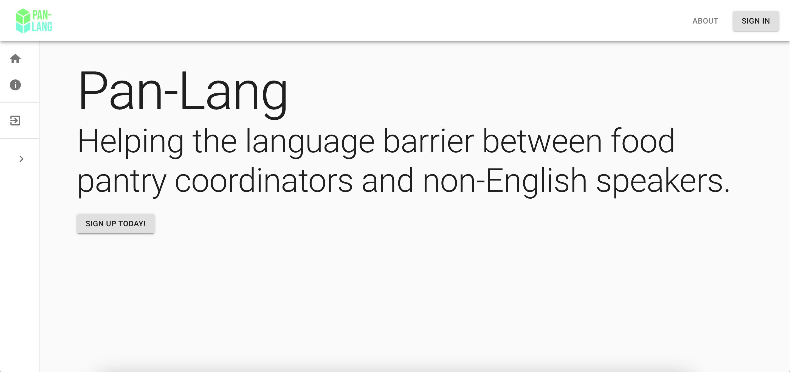
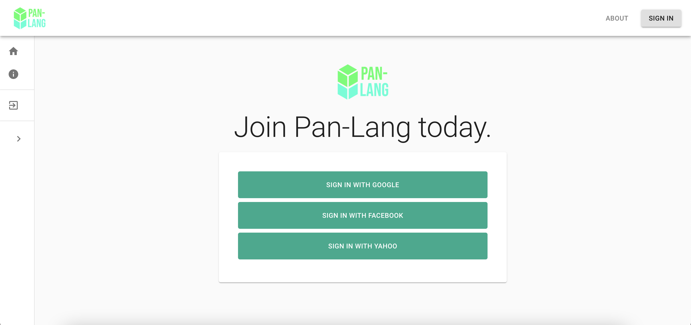
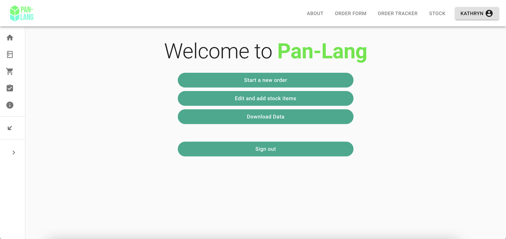
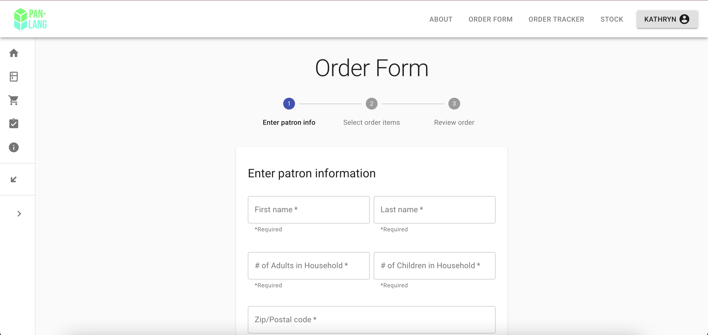
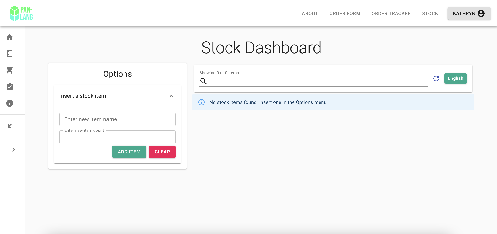

# Frontend
Repository for Pan-Lang's frontend/UI.

# Access Here
https://pan-lang.github.io

## Project Motivation
One of our team members currently volunteers at the Mckinley Foundation Food Pantry at the Garden Hills Elementary. He noticed that there were communication barriers between the pantry coordinator and the non-english speaking people. Our team decided to tackle this problem by creating a webapp and helping the food pantry coordinator with direct translations of stock items and common phrases/questions for multiple languages, while also keeping track of the stock of the food items.

## Tech Stack
The frontend was built with:
  - [React](https://reactjs.org/)
  - [Material-UI](https://material-ui.com/)
  - [Firebase](https://firebase.google.com/)
  - [Node.js](https://nodejs.org/en/)
  - [Axios](https://github.com/axios/axios)
  - [Socket.io](https://socket.io/)
  
  ## Layout (desktop)
  
  
  

  

  
  
  
  
  ## Installation
  1. Make sure to have npm installed on your machine. Instructions for installing npm can be found [here](https://www.npmjs.com/get-npm).
  2. `git clone Pan-Lang` in the designated folder on your machine.
  3. `npm install` to install the project dependencies.
  4. The core component of this project makes use of the Google Cloud Translate API. If you want to use translation features, you'll have to make a new project on Google Cloud Platform and generate a new API key. Detailed instructions for this setup can be found [here](https://cloud.google.com/translate/docs/setup).
